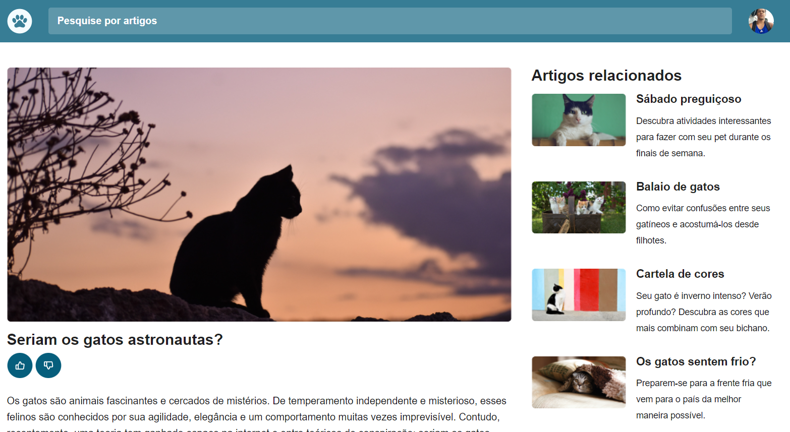

<h1 align="center"> Projeto Blog de Gatos </h1>

Programa exclusivo do Explore, promovido pela Rocketseat para ensino de tecnologias WEB.  

  <a href="#-tecnologias">Tecnologias</a>&nbsp;&nbsp;&nbsp;|&nbsp;&nbsp;&nbsp;
  <a href="#-projeto">Projeto</a>&nbsp;&nbsp;&nbsp;|&nbsp;&nbsp;&nbsp;
  <a href="#-layout">Layout</a>&nbsp;&nbsp;&nbsp;|&nbsp;&nbsp;&nbsp;
  <a href="#memo-licença">Licença</a>

  

 

  

## 🚀 Tecnologias

Esse projeto foi desenvolvido com as seguintes tecnologias:

- HTML e CSS
- Git e Github

## 💻 Projeto

O projeto Blog dos Gatos foi construído para o reforço para o estudo de grid e animações, reforçando os confeitos de css.

## 🔖 Layout

Você pode visualizar o layout do projeto através [DESSE LINK](https://www.figma.com/community/file/1256354927622258124/blog-de-gatos-desafio-explorer). É necessário ter conta no [Figma](https://figma.com) para acessá-lo.

## 📄 Licença

Esse projeto está sob a licença MIT.

---

Feito com ♥ by Ricardo Martins 